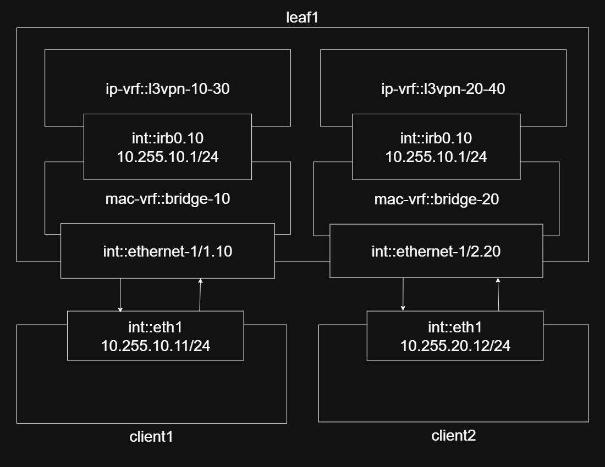

# vrf-lite inter instance route leaking example


Requires [containerlab](https://containerlab.dev/install/)

```
Available Make targets:
  help            Show this help message
  install         Install containerlab (may require sudo executes https://get.containerlab.dev)
  deploy          Deploy the containerlab topology
  destroy         Destroy the containerlab topology
  reset           Destroy and redeploy the topology
  status          Quick status check of the topology
  inspect         Inspect the running lab with detailed information
  save            Save configurations from running containers
  test-ping       Test connectivity between clients
  clean           Clean up all lab artifacts
```

## Diagram

